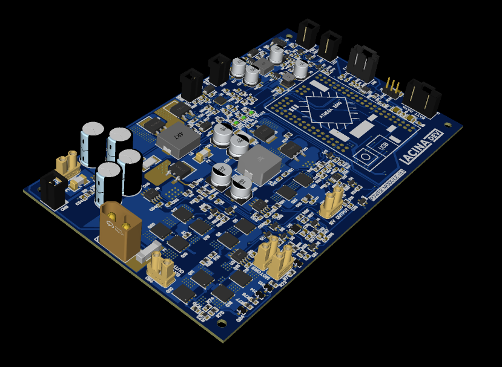

# Power module
 Schematic, 3D model and manufacture files for the VITULUS power module.

 For power module software see [Power module v3.1](https://github.com/lacina-dev/powermodulev3_1).

 For power module extension see [Power module extension](https://github.com/lacina-dev/power_module_extension).

 For more info see this doc. 
 [VITULUS Power module assembly and wiring](https://docs.google.com/document/d/1gbUeb38EpmrZyLzsyhS_GtbKjz4Z-vhWeXakbzIWZlc/edit?usp=sharing)

 More about VITULUS? See my website.
 [https://lacina.dev](https://lacina.dev)

 Questions? Try Discord.
 [Discord channel](https://discord.gg/YqeNV5hEVN)

----------

Power module board

Power module assembled

